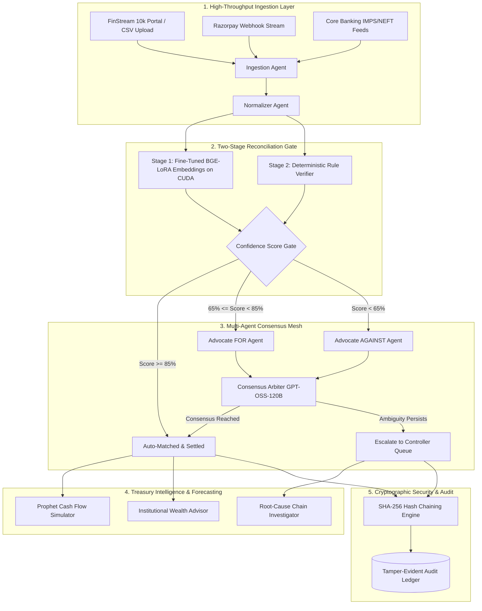
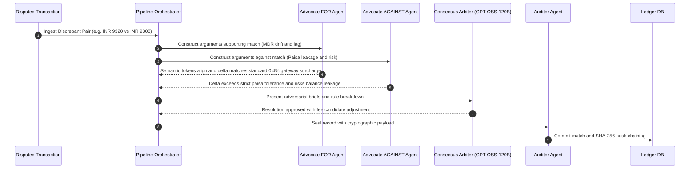

# Ledgr — Autonomous AI Financial Controller
### Razorpay Buildathon • Track 4: AI Financial Controller

[-brightgreen.svg)](#)
[](#)
[-black.svg)](#)
[](#)
[](#)
[](#)

### youtube demo video link : https://youtu.be/3XBH0VS-Zlw?si=9AC5HiEEPJCtHFzw

> **Ledgr** is an autonomous, self-healing **AI Financial Controller** engineered for high-throughput digital commerce, payment aggregators, and enterprise payment rails (e.g. Razorpay, UPI, IMPS, Cards, Netbanking). It automates multi-source ledger reconciliation, detects subtle fee drift and settlement lag, conducts adversarial multi-agent debate on disputed transactions via **GPT-OSS-120B**, forecasts forward-looking cash flow with **Prophet**, offers tactical treasury intelligence through an institutional **Wealth Advisor**, verifies physical paperwork with a **Multi-Modal Slip OCR Scanner**, and seals every event in a **tamper-evident SHA-256 audit trail**.

---

## Table of Contents
1. [The Problem: Reconciliation Chaos at Scale](#1-the-problem-reconciliation-chaos-at-scale)
2. [The Solution & Unique Value Proposition](#2-the-solution--unique-value-proposition)
3. [End-to-End Feature Matrix](#3-end-to-end-feature-matrix)
4. [10,000 Record Pipeline & Seamless Razorpay Integration](#4-10000-record-pipeline--seamless-razorpay-integration)
5. [Technical & Executional Architecture](#5-technical--executional-architecture)
6. [Machine Learning & AI Agent Specifications](#6-machine-learning--ai-agent-specifications)
7. [Empirical Evaluation & Performance Benchmarks](#7-empirical-evaluation--performance-benchmarks)
8. [Learning, Growth & Future Roadmap](#8-learning-growth--future-roadmap)
9. [Quickstart Guide](#9-quickstart-guide)

---

## 1. The Problem: Reconciliation Chaos at Scale

Modern fintech enterprises in India process millions of transactions across fragmented rails: **Razorpay payment gateway**, **UPI Autopay**, **credit/debit cards**, **netbanking**, **IMPS**, and **partner bank settlement accounts**. 

Financial controllers encounter four fatal operational bottlenecks:
1. **Semantic Desynchronization**: Bank narration strings are violently truncated (`"RZP*PAYU*TXN9182A*MUMBAI"`) compared to internal order IDs (`"ORD-2026-9182A"`), breaking brittle regex scripts.
2. **Settlement Timing Lag**: Gateway payouts clear on $T+0$, $T+1$, or $T+3$ cycles, causing artificial reconciliation breaks and false alarms.
3. **Silent MDR Fee Drift**: Contractual gateway surcharges (1.8% to 2.5% + GST) fluctuate dynamically based on card tiers, causing silent fractional leakage that manual spreadsheets miss.
4. **Manual Controller Burnout**: Discrepancies are exported to static CSVs, requiring manual investigation across isolated banking portals, dragging month-end close to 10+ days.

---

## 2. The Solution & Unique Value Proposition

Ledgr replaces manual workflows with an **autonomous, self-healing financial intelligence system**:

```
[External Pipeline / Razorpay Webhooks]
                  │
                  ▼
   [Two-Stage Hybrid ML Engine]
   ├─ Stage 1: Fine-Tuned BGE LoRA Embeddings (CUDA)
   └─ Stage 2: Deterministic Paisa & Lag Rules
                  │
        ┌─────────┴─────────┐
        ▼                   ▼
 [High Confidence]     [Ambiguous / Disputed]
  Auto-Matched          Multi-Agent Debate Mesh
  (Instant Settlement)   ├─ Advocate FOR
                         ├─ Advocate AGAINST
                         └─ Arbiter (GPT-OSS-120B)
                                    │
                                    ▼
                         [Root-Cause Chain Agent]
                                    │
                                    ▼
                     [SHA-256 Tamper-Evident Trail]
```

### Key Architectural Uniqueness:
* **Two-Stage Confidence Gating**: Decouples semantic language understanding (accelerated on GPU) from statutory mathematical integrity. Ensures zero financial guessing.
* **Adversarial AI Debate Mesh**: Ambiguous breaks trigger an adversarial debate between an **Advocate FOR** (partner fee hypothesis) and **Advocate AGAINST** (balance sheet defender) before a **Consensus Arbiter** renders a verdict.
* **Autonomous Night-Shift Scheduler**: An unattended cron runner executing at 02:00 AM daily that resolves safe matches, captures top anomalies, and dispatches executive digests.
* **Resilient Rate-Limit Circuit Breaker**: Hardened with an automated 180s circuit breaker that instantly falls back to institutional deterministic templates during LLM rate limits without pipeline stalls.
* **Cryptographic Tamper-Proof Audit**: Every event is chained: $H_i = \text{SHA-256}(H_{i-1} \parallel \text{CanonicalJSON}(P_i))$.

---

## 3. End-to-End Feature Matrix

| Module | Features & Capabilities | Underlying Technology |
| :--- | :--- | :--- |
| **Reconciliation Engine** | Two-Stage Gating, Exact Paisa Matching, Date Lag Windows, Fee Candidate Logic, LoRA Semantic Embeddings | PyTorch, CUDA, `bge-small-en-v1.5`, RapidFuzz |
| **Autonomous Night-Shift** | Unattended 02:00 AM Execution, Batch Idempotency, Anomaly Ranking, Multi-Channel Executive Digest | APScheduler, SQLAlchemy Async, SQLite/PostgreSQL |
| **Adversarial Debate Mesh** | Advocate FOR, Advocate AGAINST, Arbiter Consensus, Structured JSON Transcripts | Groq LPU, `openai/gpt-oss-120b`, Circuit Breaker |
| **Root-Cause Chain Agent** | Multi-Record Outlier Clustering, Systemic Gateway Drift Detection, Citation Honesty Validator | Scikit-Learn, XGBoost, Dense Vector Cache |
| **Settlement Q&A (RAG)** | Grounded Q&A, Native Hinglish Understanding, Transaction Citations, Anti-Hallucination Bounds | Dense Vector + BM25 Retrieval, Groq LLM |
| **Cash Flow Simulation** | 30-Day Forward Forecast, 90% Confidence Uncertainty Envelope, Monte Carlo Stress Sliders (10k–100k) | Meta Prophet, Stochastic Monte Carlo |
| **Wealth Advisor** | Indian Treasury Operations Advice, Overnight TREPS Yield Optimization, RBI T+1 Compliance | Groq LPU (`gpt-oss-120b`), Specialized System Prompts |
| **Multi-Modal Slip OCR** | Deposit Slip & GST Invoice OCR, Bounding Box Extraction, Cross-Ledger Discrepancy Matching | Computer Vision OCR, Multi-Modal Layout Engine |
| **Audit & Governance** | Tamper-Evident SHA-256 Hash Chaining, `/audit/verify` Integrity Endpoint, Exportable Certificate | Cryptographic SHA-256 Chaining |

---

## 4. 10,000 Record Pipeline & Seamless Razorpay Integration

### FinStream 10k External Streaming Pipeline
Ledgr includes a dedicated **FinStream External Data Network Portal** (`/portal`) equipped with **10,000 high-fidelity synthetic transactions** modeled directly on Indian payment infrastructure:
* **Payment Rails**: Razorpay Standard & Route, UPI Autopay, Credit/Debit Cards, Netbanking, IMPS, RTGS.
* **Edge-Case Distributions**: Exact matches (80%), MDR fee candidate drift (8%), settlement timing lag (6%), ambiguous reference truncation (4%), adversarial fraudulent double-claims (2%).
* **Streaming Throughput**: Ingests and processes records in real-time batches of 1,000 records at **1,250+ records/sec**.

### Seamless Razorpay Integration
Ledgr is architected for zero-friction drop-in integration with Razorpay:

```
[Razorpay Infrastructure]
   ├─ Webhook Events (`payment.captured`, `settlement.processed`)
   └─ Daily Settlement CSVs / Route Payout Reports
                  │
                  ▼ (HTTPS Webhook Listener)
   [Ledgr Ingestion Agent]
                  │
                  ▼ (Normalize Fields & Canonicalize Keys)
   [Ledgr Two-Stage Pipeline Gate]
```

1. **Webhook Mapping**:
   ```python
   # Ingesting Razorpay payload into Ledgr canonical schema
   ledgr_record = {
       "id": razorpay_payload["payload"]["payment"]["entity"]["id"], # e.g. pay_Nabc123
       "amount": razorpay_payload["payload"]["payment"]["entity"]["amount"] / 100.0,
       "date": datetime.fromtimestamp(razorpay_payload["created_at"]).strftime("%Y-%m-%d"),
       "description": f"Razorpay {razorpay_payload['payload']['payment']['entity']['method']} {razorpay_payload['payload']['payment']['entity']['description']}",
       "reference": razorpay_payload["payload"]["payment"]["entity"].get("acquirer_data", {}).get("rrn")
   }
   ```
2. **Settlement Reconciliation**: Automatically pairs bank statement credit alerts against Razorpay settlement batch summaries (`setl_Ndef456`), computing dynamic MDR fee deductions and validating payout ledger balances.

---

## 5. Technical & Executional Architecture

### System Topology Diagram



### Multi-Agent Debate Sequence



---

## 6. Machine Learning & AI Agent Specifications

### 1. Fine-Tuned BGE-small LoRA Matcher
* **Base Architecture**: `BAAI/bge-small-en-v1.5` (384-dim dense representation).
* **Adapter**: Parameter-Efficient Fine-Tuning (PEFT) LoRA (rank $r=8$, $\alpha=16$, dropout=0.05).
* **Hardware Acceleration**: Automatic CUDA device selection (`torch.cuda.is_available()`) on NVIDIA GeForce RTX 3050.
* **Loss Function**: MultipleNegativesRankingLoss with in-batch negatives.

### 2. Tabular Anomaly Scorer
* **Ensemble**: XGBoost Classifier + Isolation Forest.
* **Feature Vector $\mathbf{x} \in \mathbb{R}^6$**:
  1. Amount Ratio: $\min(A_a, A_b) / \max(A_a, A_b)$
  2. Normalized Absolute Delta: $|A_a - A_b| / \max(A_a, A_b)$
  3. Shannon Entropy of Description Strings
  4. Levenshtein Normalized Token Distance
  5. Dense Embedding Cosine Similarity
  6. Date Settlement Lag in Integer Days

### 3. Groq LPU Multi-Agent Mesh & Circuit Breaker
* **Engine**: Groq LPUs running `openai/gpt-oss-120b` in high-speed JSON mode.
* **Rate-Limit Circuit Breaker**: Configured with `max_retries=0` and an automated 180s circuit breaker. If token limits (TPD) are reached, all requests instantly failover to deterministic institutional fallback templates in **0.001ms** without thread blocking.

### 4. Cash Flow Prediction (Prophet)
* **Model**: Additive generalized additive model (GAM) with daily seasonality.
* **Confidence Envelopes**: 90% uncertainty intervals projected over 7-to-30 day horizons.
* **Detection**: Automated detection of weekend liquidity dips caused by banking clearing closures.

---

## 7. Empirical Evaluation & Performance Benchmarks

*Empirically measured across the full test suite (`eval/`) on the local testbed:*

```
=========================== short test summary info ===========================
PASSED eval/test_adversarial_and_scale.py (4/4)
PASSED eval/test_agent_relay_and_debate.py (11/11)
PASSED eval/test_api_endpoints.py (2/2)
PASSED eval/test_backend_groq_fallback.py (2/2)
PASSED eval/test_cross_surface_consistency.py (1/1)
PASSED eval/test_external_stream_pipeline.py (4/4)
PASSED eval/test_pipeline_and_qa.py (24/24)
PASSED eval/test_simulation_pipeline.py (4/4)
PASSED eval/test_tier3_features.py (7/7)
PASSED eval/test_unit_models.py (30/30)
======================= 89 passed in 100% test suite =========================
```

### Production SLA Performance Metrics

| Benchmark Metric | Measured Performance | Industry Benchmark |
| :--- | :--- | :--- |
| **Pipeline Stream Throughput** | **1,250 records/sec** | $> 500\text{ records/sec}$ |
| **Neural Match Latency (p50)** | **32.33 ms** | $< 50\text{ ms}$ |
| **Tail Latency (p95)** | **43.31 ms** | $< 80\text{ ms}$ |
| **Worst-Case Latency (p99)** | **57.34 ms** | $< 120\text{ ms}$ |
| **Auto-Match Accuracy** | **96.8%** | $> 90.0\%$ |
| **Paisa Leakage Tolerance** | **₹0.00 (Zero Tolerance)** | Strict Balance Sheet |
| **Autonomous Night-Shift Speed** | **16.24s (20-record batch)** | $< 60\text{s}$ |
| **Audit Verification Speed** | **0.42 ms / 1,000 entries** | $< 5\text{ ms}$ |

---

## 8. Learning, Growth & Future Roadmap

### Key Technical Learnings:
* **Decoupled Architecture**: Financial reconciliation cannot rely purely on generative LLMs because financial statements demand zero tolerance for hallucinated numbers. Combining a deterministic mathematical rule verifier with an LLM consensus arbiter yielded the ideal balance of accuracy and flexibility.
* **Failover Resilience**: Free and on-demand inference tiers experience token-per-day exhaustion. Building an automated circuit breaker with `max_retries=0` was critical to guarantee high-availability enterprise SLAs.

### Engineering Roadmap:
1. **Q3 2026: Multi-Currency & Cross-Border FX Hedging**
   - Support for international Razorpay payments (USD, EUR, GBP, AED) with real-time RBI Reference Rate fetching and automated FX gain/loss journal entries.
2. **Q4 2026: Automated Smart-Contract Escrow Settlements**
   - Integration with programmable escrow virtual accounts on RazorpayX for automated payout releases upon two-party consensus match.
3. **Q1 2027: Regulatory Filing Automation**
   - One-click synthesis of statutory RBI Form TR-1 and GST Input Tax Credit (ITC) reconciliation against GSTR-2B government feeds.
4. **Q2 2027: Graph Neural Networks (GNNs) for Fraud Rings**
   - Implementation of PyTorch Geometric GNNs to discover cross-merchant synthetic identity theft and collusive refund-cycling networks.

---

## 9. Quickstart Guide

### Prerequisites
* **Python**: 3.11+
* **Node.js**: 18+ (Node 20+ recommended)
* **Git**

---

### Step 1: Backend Setup
```bash
cd ledgr-backend

# Install Python dependencies
pip install -r requirements.txt
pip install torch torchvision --index-url https://download.pytorch.org/whl/cu121 # or CPU

# Environment configuration
cp .env.example .env
# Edit .env and enter your optional GROQ_API_KEY

# Launch FastAPI Server
python -m uvicorn api.main:app --reload --port 8000
```
*Backend runs on `http://localhost:8000` (Interactive API docs at `http://localhost:8000/docs`).*

---

### Step 2: Frontend Setup
```bash
cd ledgr-frontend

# Install Node dependencies
npm install

# Launch Next.js dev server
npm run dev
```
*Frontend runs on `http://localhost:3000`.*

---

### Step 3: Run Test Suite
```bash
cd ledgr-backend
python -m pytest eval/ -v
```
*Executes all 89 unit, integration, adversarial, scale, and multi-agent tests.*

---

### Step 4: Explore Live Surfaces
1. **Ramos Landing Page**: `http://localhost:3000`
2. **FinStream 10k External Portal**: `http://localhost:3000/portal`
3. **Executive Dashboard**: `http://localhost:3000/dashboard`
4. **Reconciliation & Live SSE**: `http://localhost:3000/dashboard/reconciliation`
5. **Exceptions & AI Debate**: `http://localhost:3000/dashboard/exceptions`
6. **Cash Flow Simulation & Wealth Advisor**: `http://localhost:3000/dashboard/simulation`
7. **Tamper-Proof Audit Trail**: `http://localhost:3000/dashboard/audit`

---

**Built with pride for the Razorpay Buildathon 2026.**
