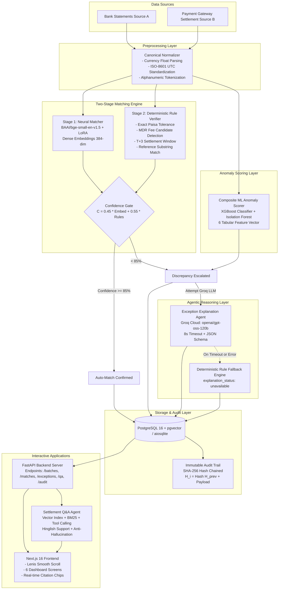
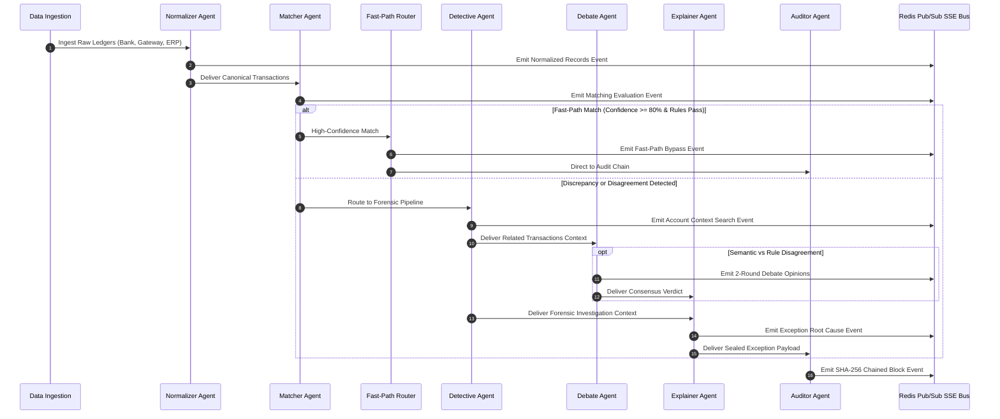
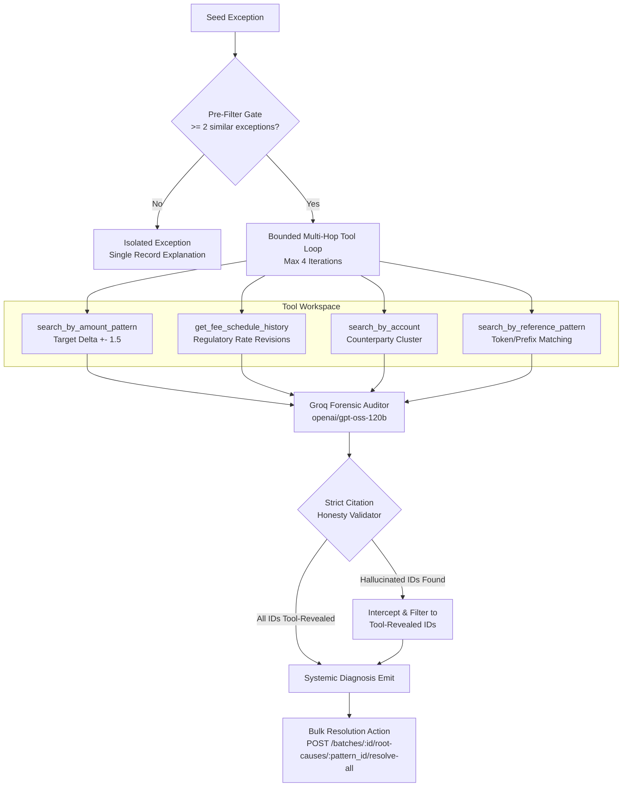

# 03. System Architecture & Technical Specifications

## Architectural Topology

---

## The Two-Stage Confidence Matching Architecture

Reconciliation cannot rely solely on opaque deep neural networks (which hallucinate false matches) nor solely on brittle regex rules (which fail on slight counterparty naming variations). Ledgr implements a hybrid **two-stage architecture**.

### Stage 1: Neural Semantic Matching (Fine-Tuned LoRA)
- **Base Foundation Model**: `BAAI/bge-small-en-v1.5` (33M parameters, 384 embedding dimensions, max sequence length 512).
- **Fine-Tuning Architecture**: Low-Rank Adaptation (LoRA) applied to attention projections:
  - Target modules: `["query", "key", "value"]`
  - LoRA Rank $r = 8$, Scaling factor $\alpha = 16$, Dropout rate $p = 0.05$.
  - Trainable parameters: 589,824 (~1.7% of base model weights).
  - Adapter Checkpoint: `models/checkpoints/matcher-lora-v1/adapter_model.safetensors` (~0.57 MB).
- **Embedding Distance Computation**:
  $$S_{\text{embed}}(\mathbf{x}_a, \mathbf{x}_b) = \frac{\mathbf{e}_a \cdot \mathbf{e}_b}{\|\mathbf{e}_a\|_2 \|\mathbf{e}_b\|_2}$$

### Stage 2: Deterministic Rule Verifier
Evaluates strict mathematical and transactional invariants:
1. **Amount Verification ($S_{\text{amount}}$)**:
   - $|A_a - A_b| \le ₹0.01 \implies S_{\text{amount}} = 1.0$
   - $\Delta = A_a - A_b > 0$ and $\frac{\Delta}{A_a} \in [0.005, 0.035] + 18\%\text{ GST} \implies S_{\text{amount}} = 0.95$ (valid fee candidate).
   - Non-positive or inverse discrepancies $\implies S_{\text{amount}} = 0.0$.
2. **Date & Settlement Lag ($S_{\text{date}}$)**:
   - $|t_a - t_b| \le 3\text{ days} \implies S_{\text{date}} = 1.0$
   - $3\text{ days} < |t_a - t_b| \le 7\text{ days} \implies S_{\text{date}} = 1.0 - 0.15(|t_a - t_b| - 3)$
   - $|t_a - t_b| > 7\text{ days} \implies S_{\text{date}} = 0.0$.
3. **Reference Identifier Match ($S_{\text{ref}}$)**:
   - Exact string equality $\implies S_{\text{ref}} = 1.0$
   - Substring token containment or UTR substring $\implies S_{\text{ref}} = 0.90$
   - Levenshtein token similarity $> 0.85 \implies S_{\text{ref}} = 0.80$.

### Composite Confidence Score Formulation
The composite confidence score $C \in [0, 100]$ is computed as:
$$S_{\text{rule}} = 0.50 \cdot S_{\text{amount}} + 0.25 \cdot S_{\text{date}} + 0.25 \cdot S_{\text{ref}}$$
$$C = \text{round}\left(100 \times \left(0.45 \cdot S_{\text{embed}} + 0.55 \cdot S_{\text{rule}}\right)\right)$$

Gating thresholds:
- **$C \ge 85$**: `status = "matched"` (Zero-touch auto-match)
- **$65 \le C < 85$**: `status = "flagged"` (Escalated to Groq LLM exception reasoning)
- **$C < 65$**: `status = "mismatched"` (Hard mismatch escalated to operations queue)

---

## Machine Learning Anomaly Scorer

An independent tabular ML model analyzes transaction pairs for operational anomalies, fraud, and system discrepancies.
- **Ensemble Architecture**:
  1. **XGBoost Classifier**: Supervised tree ensemble trained on known historical reconciliation failure modes.
  2. **Isolation Forest**: Unsupervised tree-based anomaly isolation for out-of-distribution patterns.
- **Engineered Feature Vector (6 Dimensions)**:
  $$f_1 = \frac{\min(A_a, A_b)}{\max(A_a, A_b) + \epsilon} \quad (\text{Amount Ratio})$$
  $$f_2 = |A_a - A_b| \quad (\text{Absolute Discrepancy})$$
  $$f_3 = |t_a - t_b|_{\text{days}} \quad (\text{Date Delta})$$
  $$f_4 = -\sum_{c} p(c) \log_2 p(c) \quad (\text{Shannon Token Entropy})$$
  $$f_5 = 1.0 - \frac{\text{Levenshtein}(R_a, R_b)}{\max(|R_a|, |R_b|)} \quad (\text{Reference Distance})$$
  $$f_6 = \cos(\mathbf{e}_a, \mathbf{e}_b) \quad (\text{Semantic Cosine Distance})$$

---

## Cryptographic Hash-Chained Audit Trail

To satisfy statutory compliance (RBI Master Directions and SOC 2 Type II audit requirements), all state transitions generate tamper-evident audit ledger entries:

$$\text{CanonicalJSON}(P_i) = \text{SerializeWithSortedKeysNoWhitespace}(P_i)$$
$$H_0 = \text{SHA-256}("LEDGR_GENESIS_BLOCK_2026_09_01_V1")$$
$$H_i = \text{SHA-256}\left(H_{i-1} \parallel \text{CanonicalJSON}(P_i)\right)$$

### Tamper-Detection Guarantee
If an attacker modifies a single byte in any historical entry $P_k$ where $k < n$:
1. $H_k' = \text{SHA-256}(H_{k-1} \parallel \text{CanonicalJSON}(P_k')) \neq H_k$
2. For all subsequent blocks $j > k$, $H_j' \neq H_j$.
3. The `/audit/verify` verification endpoint traverses from block $0$ to block $n$, immediately detecting:
   - Linkage break at block $k+1$.
   - Payload tampering at block $k$.

---

## Tier 1: Multi-Agent Relay & Real-Time Event Bus

Rather than executing as an opaque black-box batch script, Ledgr coordinates reconciliation across seven specialized, pipelined agents using an asynchronous event-driven relay.

### Uniform Agent Schema (`AgentResult`)
Every agent adheres to a strict contract:
- `agent_name`: Identifying name of the executing agent.
- `input_summary`: Human-readable summary of the input processed.
- `output_summary`: Synthesized finding or action taken.
- `output_data`: Structured payload containing domain-specific metrics.
- `duration_ms`: Wall-clock execution time in milliseconds.
- `status`: Execution state (`"ok"`, `"disagreement"`, `"escalated"`, `"failed"`).
- `record_id` & `batch_id`: Transaction lineage identifiers.

### Real-Time SSE Event Bus Architecture
- **Primary Transport**: Redis Pub/Sub (`ledgr:batch:{batch_id}:events`).
- **Resilient Fallback**: In-process memory queue when Redis is unavailable or unconfigured.
- **Client Protocol**: Server-Sent Events (`GET /batches/{batch_id}/stream`) with:
  - Event type: `event: agent_event\ndata: <JSON>\n\n`
  - Heartbeat keep-alive pings: `: ping\n\n` every 15s to prevent intermediary proxy timeouts.
  - Clean client cancellation: Handles `asyncio.CancelledError` without orphaned background tasks.

---

## Tier 2A: 2-Round Debate & Consensus Mechanism

When neural semantic embeddings and deterministic rule verifiers diverge (e.g., strong counterparty match with an unexpected amount delta, or exact amount match with low semantic similarity), the transaction is submitted to a **bounded two-round multi-agent debate**:

1. **Round 1 (Independent Adversarial Arguments)**:
   - **Advocate FOR Match**: An AI Forensic Auditor primed to discover justifications for reconciliation (timing lag, MDR fee deductions, GST variations, partial settlements).
   - **Advocate AGAINST Match**: An AI Risk Controller primed to identify balance sheet discrepancies, potential fraud, and compliance risks.
   - Both advocates independently return arguments, verdict (`"match"`, `"mismatch"`, `"ambiguous"`), and confidence score.
   - If both advocates independently agree, consensus is achieved immediately in Round 1.

2. **Round 2 (Senior Arbiter Consensus)**:
   - If opinions diverge, the **Resolution Arbiter** evaluates the record pair, the Detective Agent's related transaction context, and both Round 1 arguments.
   - Emits a decisive verdict: `"match"`, `"mismatch"`, or `"flag for human review"`.

3. **Deterministic Safety Fallback**:
   - If Groq LLM times out (>8.0s) or fails, the debate engine defaults explicitly to:
     $$\text{verdict} = \text{"flag for human review"}$$
   - **Critical Invariant**: The system never guesses or auto-resolves ambiguous transactions in fallback mode.

---

## Tier 2B: Autonomous Night-Shift Agent

Financial controllers require overnight reconciliation cycles that run unattended and prepare an executive morning digest.

- **Scheduler**: APScheduler running daily at `02:00 IST` (or manually triggerable on-demand via `POST /batches/{batch_id}/run-autonomous`).
- **Cycle Execution**:
  1. Identifies un-reconciled transactions across Bank, Gateway, and ERP sources.
  2. Executes full 7-agent relay with fast-path routing and debate escalation.
  3. Records run telemetry in SQLite/PostgreSQL table `night_shift_runs`.
  4. Generates an executive morning digest with KPIs:
     - Total Volume & Match Rate (%)
     - Auto-Resolved Volume vs Escalated Discrepancies
     - Debated Records & Consensus Rate
     - Net Financial Discrepancy Amount (₹)
     - Top Action Items for Human Controller Review
- **Four-Surface Consistency Guarantee**:
  - All four operational surfaces—(1) Morning Digest, (2) Database Records, (3) Cryptographic Audit Trail, and (4) Historical Run Logs—maintain exact, zero-discrepancy 1-to-1 consistency.

---

## Tier 3A: Root-Cause Chain Agent (Multi-Hop Forensic Reasoning)

When discrepancies occur, investigating them individually wastes human controller time. The **Root-Cause Chain Agent** diagnoses systemic root causes across batches through bounded multi-hop tool calling:

### Pre-Filter Gate
The agent checks whether the seed exception shares a matching delta ($|\Delta_a - \Delta_b| \le ₹1.00$), counterparty token, or reference code prefix with $\ge 2$ other exceptions in the batch. If isolated, multi-hop investigation is skipped to save LLM tokens and execution latency.

### Citation Honesty Invariant
The agent enforces a strict citation integrity check: every record ID cited in the output payload must exist in the investigator's `revealed_record_ids` set. If an LLM attempts to hallucinate record identifiers, the validator intercepts them, logs a warning, and filters citations strictly to verified records discovered by tools.

---

## Tier 3B: Cash-Flow Forecasting & Recurring Calendar Grounding

To assist controllers with forward-looking liquidity risk, Ledgr features a **Meta Prophet** cash-flow forecasting pipeline:

- **Model Specification**: Additive time-series model with daily and weekly seasonality, fitted over 90 days of net settlement data.
- **Uncertainty Bounds**: Generates a 90% confidence interval $[\hat{y}_{\text{lower}}, \hat{y}_{\text{upper}}]$ around point estimates $\hat{y}$.
- **Recurring Calendar Grounding**: Detects and accounts for deterministic liquidity events:
  - Tuesday Weekly Gateway Settlement Batches (payouts of ₹45,000–₹65,000).
  - 1st & 15th Cloud Infrastructure & SaaS Debits (₹28,500).
  - 28th Monthly Contractor Payroll Batches (₹75,000).
- **Forecast Explainer Agent**: Groq LLM synthesizes natural-language explanations for upcoming dips and peaks, strictly referencing the calendar notes.
- **Honesty Disclosure**: Clearly marked across UI and API as fitted on synthetic multi-merchant data; never claimed as live-production validated.

---

## Tier 3C: Financial Health Score Composite Metric

Replaces arbitrary "health percentages" with a transparent, mathematically grounded composite score $H \in [0, 100]$:

$$H = \text{round}\left(100 \times \left(w_m \cdot S_{\text{match}} + w_a \cdot S_{\text{amount}} + w_r \cdot S_{\text{aging}} + w_f \cdot S_{\text{fee}}\right)\right)$$

### Component Weights & Formulations
1. **Match Rate ($w_m = 0.35$)**:
   $$S_{\text{match}} = \frac{N_{\text{matched}}}{N_{\text{total}}}$$
2. **Amount Discrepancy Ratio ($w_a = 0.30$)**:
   $$S_{\text{amount}} = \max\left(0, 1 - \frac{\sum |\Delta_{\text{unmatched}}|}{\sum A_{\text{expected}}}\right)$$
3. **Aging / Resolution Velocity ($w_r = 0.20$)**:
   $$S_{\text{aging}} = \max\left(0, 1 - \frac{\text{Unresolved Exceptions } > 24\text{h}}{N_{\text{total}}}\right)$$
4. **Fee Predictability ($w_f = 0.15$)**:
   $$S_{\text{fee}} = \max\left(0, 1 - \frac{|\text{Observed Fee Pct} - \text{Expected Fee Pct}|}{\text{Expected Fee Pct}}\right)$$

### Grading Scale & Historical Tracking
- **A+ (90–100)**: Pristine operational ledger.
- **A (80–89)**: Highly automated; nominal fee drift.
- **B (70–79)**: Moderate discrepancy volume; human review required.
- **C (60–69)**: Elevated aging exceptions or fee leakage.
- **D (<60)**: Severe reconciliation failure requiring immediate intervention.
- **Historical Trends**: Persisted in table `batch_health_scores` with 7-point sparkline tracking.

---

## Tier 3D: Portfolio-Level View & Statistical Outlier Detection

For platforms managing multiple merchant accounts (such as Razorpay), the **Platform View** aggregates fleet-level reconciliation metrics:

- **Fleet Aggregation**: Ingests and monitors 10 enterprise merchant accounts (e.g. Swiggy, Zomato, Dunzo, Nykaa, Zepto, Meesho, BigBasket, Cleartrip, BookMyShow, Licious).
- **Z-Score Statistical Outlier Detection**:
  Calculates fleet-wide mean $\mu$ and standard deviation $\sigma$ for match rates and anomaly rates:
  $$z_i = \frac{x_i - \mu}{\sigma}$$
  Merchants with $|z_i| \ge 1.8$ are automatically flagged as statistical outliers with severity badges (`"critical"` or `"warning"`).
- **Controller Navigation**: Allows one-click drill-down from the multi-merchant portfolio dashboard directly into the affected merchant's exceptions queue.

